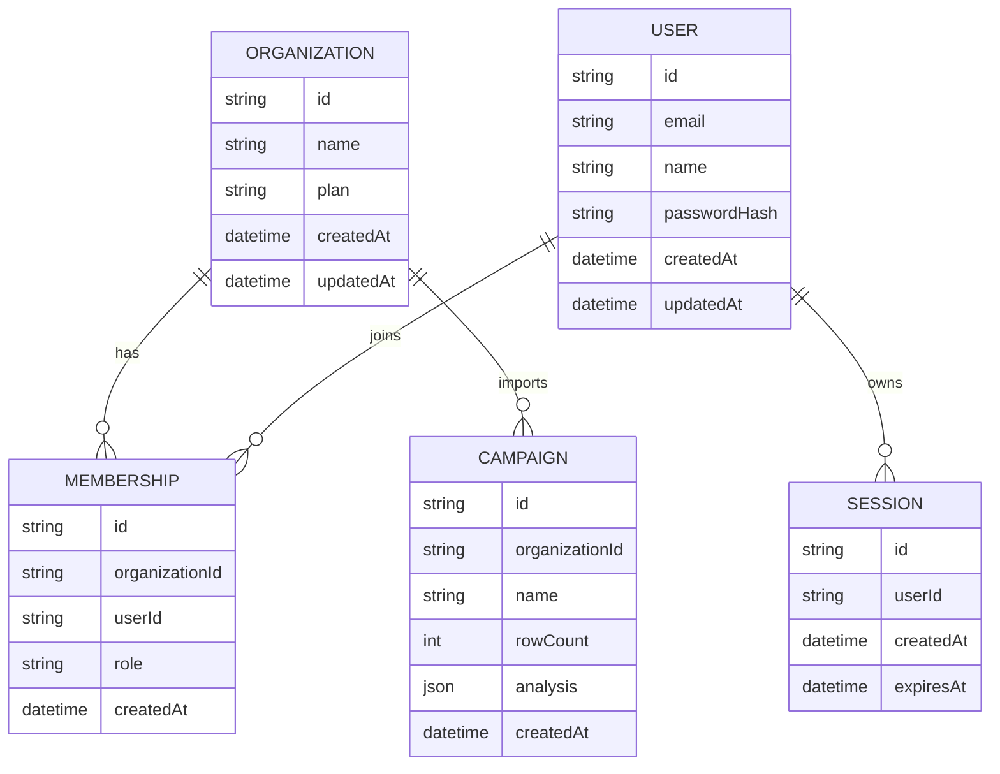

# معماری MVP واقعی MarginLift

## هدف نسخه فعلی

این نسخه، دمو را از یک فایل استاتیک به یک محصول MVP قابل‌اجرا تبدیل می‌کند:

- احراز هویت واقعی با cookie session
- فضای کاری سازمانی
- ذخیره‌سازی پایدار سمت سرور
- ورود CSV کمپین
- تحلیل uplift و هدررفت مشوق
- بازسازی داشبورد با خروجی backend

## فرض‌های معماری

- مشتری اولیه: چند کسب‌وکار پایلوت، نه ترافیک گسترده.
- مدل tenancy: چندسازمانی ساده با جدول membership.
- حساسیت داده: ایمیل کاری و داده کمپین ناشناس؛ بدون داده کارت بانکی یا اطلاعات بسیار حساس.
- هدف SLO برای پایلوت: p95 زیر ۸۰۰ms برای APIهای dashboard و auth روی دیتای کوچک، uptime هدف ۹۹٪ در نسخه deploy‌شده.
- RPO/RTO پایلوت: RPO حداکثر ۲۴ ساعت، RTO حداکثر ۴ ساعت پس از deploy واقعی.

## مدل داده

## APIهای اصلی

- `POST /api/auth/signup`
- `POST /api/auth/login`
- `POST /api/auth/logout`
- `GET /api/session`
- `GET /api/campaigns/current`
- `POST /api/campaigns/import`

## محدودیت‌های عمدی

برای سرعت اجرای MVP، دیتابیس فعلی JSON است و برای پایلوت محلی مناسب است. نسخه تجاری باید به PostgreSQL یا Supabase/Neon منتقل شود، sessionها در store امن نگه‌داری شوند، backup واقعی اضافه شود و فایل CSV در object storage ذخیره شود.
