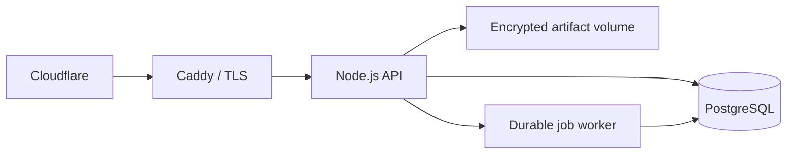

# معماری محصول MarginLift

## هدف

MarginLift یک پلتفرم تصمیم‌گیری چندسازمانی برای پایلوت‌های retention و incentive است. هر عدد مالی باید به داده، آزمایش، نسخه outcome و سطح شواهد قابل ردیابی باشد.

## معماری اجرایی

- PostgreSQL در production منبع اصلی داده است؛ فایل JSON فقط برای توسعه محلی باقی می‌ماند.
- state محصول در `marginlift_state` با تراکنش و قفل ردیف نوشته می‌شود.
- صف durable در جدول مستقل `marginlift_jobs` از `FOR UPDATE SKIP LOCKED` استفاده می‌کند.
- CSV خام با AES-256-GCM و کلیدی خارج از دیتابیس ذخیره می‌شود.
- audit عملیاتی و Decision Ledger دو زنجیره hash مستقل دارند.
- شناسه درخواست در پاسخ و structured log ثبت می‌شود.
- لایه رفتاری فقط در سطح policy/segment فرضیه می‌سازد و استنباط روان‌شناختی فردی را ممنوع می‌کند.
- اجرای مداخله رفتاری به holdout، گاردریل مالی، رضایت و سقف تماس وابسته است؛ جزئیات در `docs/behavioral-decision-layer-fa.md` ثبت شده‌اند.

## نقش‌ها

| نقش | خواندن | تحلیل و import | عملیات و audit | مدیریت اعضا |
| --- | --- | --- | --- | --- |
| `viewer` | بله | خیر | خیر | خیر |
| `analyst` | بله | بله | خیر | خیر |
| `admin` | بله | بله | بله | خیر |
| `owner` | بله | بله | بله | بله |

## مرز نسخه Pilot-Production

این معماری برای یک instance و پایلوت‌های اولیه مناسب است. state تجاری هنوز یک سند JSONB تراکنشی است و writeهای آن serialize می‌شوند. پیش از scale افقی یا بار چندصد سازمان، دامنه‌های پرترافیک باید به جدول‌های tenant-aware مجزا و object storage بیرونی منتقل شوند.

## اهداف عملیاتی

- SLO پایلوت: دسترس‌پذیری ۹۹٪ و p95 زیر ۸۰۰ms برای APIهای خواندنی کوچک.
- RPO: حداکثر ۲۴ ساعت با backup روزانه؛ هدف بعدی ۱ ساعت با WAL archive.
- RTO: حداکثر ۴ ساعت با restore تست‌شده.
- نگه‌داری backup روی VM: ۱۴ روز؛ حداقل یک نسخه رمزنگاری‌شده خارج از VM.
