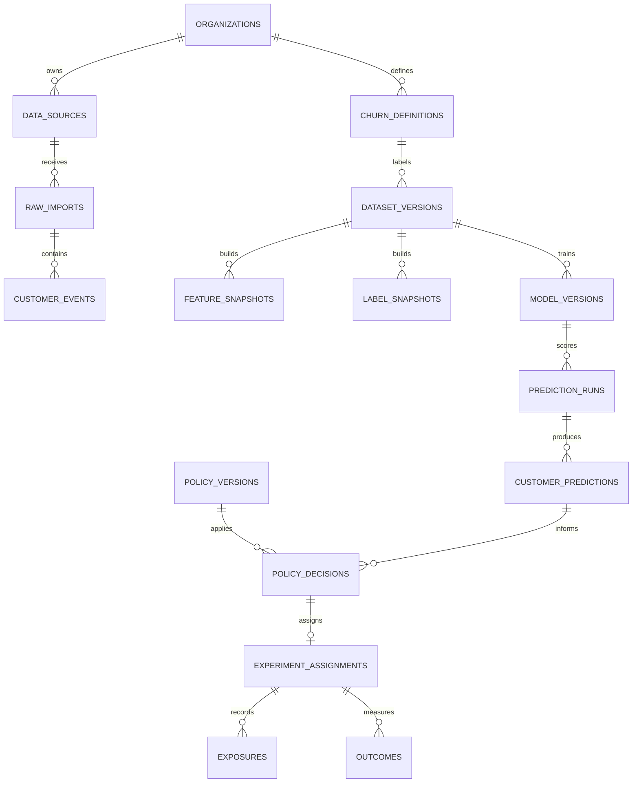

# طرح دیتابیس Churn Engine

## وضعیت

این سند یک **طرح مشروط** است، نه مجوز مهاجرت. پیاده‌سازی PostgreSQL فقط پس از عبور Gate 1 آغاز می‌شود؛ تا آن زمان دیتابیس JSON فعلی برای دمو حفظ می‌شود.

## تصمیم معماری

- PostgreSQL به‌عنوان منبع حقیقت تراکنشی.
- معماری modular monolith برای نسخه نخست.
- جداسازی tenant با `organization_id`، RBAC و تست tenant isolation.
- پردازش مدل و feature به‌صورت batch و نسخه‌بندی‌شده.
- نگه‌داری فایل خام خارج از جداول تحلیلی و با checksum تغییرناپذیر.
- بدون microservice، sharding، scoring بلادرنگ یا vector database تا اثبات نیاز.

## مدل دامنه

## موجودیت‌ها و مسئولیت

| موجودیت | مسئولیت | داده حساس |
| --- | --- | --- |
| `organizations` | مرز tenant و policy نگه‌داری | خیر |
| `data_sources` | قرارداد ورودی، timezone و currency | خیر |
| `raw_imports` | checksum، schema version، وضعیت ممیزی و محل artifact | محل فایل |
| `customer_events` | رویداد پاک‌سازی‌شده و append-only | شناسه hash‌شده |
| `churn_definitions` | eligibility، پنجره مشاهده، horizon و label rule | خیر |
| `dataset_versions` | cut-off و lineage مجموعه آموزش | خیر |
| `feature_snapshots` | featureهای point-in-time | شناسه hash‌شده |
| `label_snapshots` | label پس از بسته‌شدن horizon | شناسه hash‌شده |
| `model_versions` | artifact، feature contract، metric و approval | خیر |
| `prediction_runs` | model، dataset، زمان اجرا و health | خیر |
| `customer_predictions` | risk، calibration band و reason codes | شناسه hash‌شده |
| `policy_versions` | قواعد اقدام، سقف هزینه و `no_action` | خیر |
| `policy_decisions` | اقدام پیشنهادی و decision receipt | شناسه hash‌شده |
| `experiment_assignments` | assignment قفل‌شده و hash randomization | شناسه hash‌شده |
| `exposures` | اقدام واقعاً دریافت‌شده و زمان آن | شناسه hash‌شده |
| `outcomes` | خرید، سود، شکایت و opt-out | شناسه hash‌شده |
| `audit_log` | چه کسی، چه چیزی را، چه زمانی تغییر داد | شناسه کاربر |

## قیود غیرقابل مذاکره

- همه جدول‌های عملیاتی `organization_id`، `created_at` و شناسه UUID دارند.
- وابستگی‌های tenant با foreign key مرکب یا کنترل معادل دیتابیس محدود می‌شوند.
- `customer_events` با کلید idempotency از ورود دوباره رویداد جلوگیری می‌کند.
- `experiment_assignments` برای هر experiment و customer یکتا و پس از exposure تغییرناپذیر است.
- `model_versions` و `policy_versions` immutable هستند؛ اصلاح با نسخه جدید انجام می‌شود.
- prediction بدون `model_version_id` و `feature_snapshot_id` معتبر نیست.
- outcome پیش از بسته‌شدن پنجره با وضعیت `censored` ثبت می‌شود و وارد ارزیابی نهایی نمی‌شود.
- مقدار پول با `numeric` و currency صریح ذخیره می‌شود؛ float برای محاسبه مالی مجاز نیست.
- زمان‌ها `timestamptz` و timezone منبع در `data_sources` ثبت می‌شود.

## ایندکس‌های مبتنی بر گردش‌کار

- `customer_events (organization_id, customer_id_hash, occurred_at desc)`
- `customer_events (organization_id, event_type, occurred_at desc)`
- `feature_snapshots (organization_id, snapshot_date, customer_id_hash)`
- `customer_predictions (prediction_run_id, risk_score desc)`
- `policy_decisions (organization_id, decision_status, decided_at desc)`
- `experiment_assignments (experiment_id, assigned_group)`
- `outcomes (experiment_id, outcome_window_closed, customer_id_hash)`

ایندکس جدید فقط با query pattern واقعی و `EXPLAIN` اضافه می‌شود. partitioning پس از مشاهده حجم و latency واقعی تصمیم‌گیری می‌شود.

## ترتیب مهاجرت پس از Gate 1

1. ثبت schema هدف و query patternهای واقعی.
2. اجرای schema analyzer و رفع constraint و normalization issueها.
3. ایجاد migration افزایشی و rollback معتبر.
4. dual-write محدود در محیط staging و مقایسه row count و checksum.
5. تست unit، integration، migration، restore و tenant isolation.
6. backfill نسخه‌بندی‌شده و reconciliation مالی.
7. cutover با feature flag و امکان بازگشت.

## سیاست حذف و نگه‌داری

- PII مستقیم در ورودی رد می‌شود.
- فایل خام TTL قراردادی دارد و حذف آن audit می‌شود.
- داده تحلیلی با شناسه hash‌شده و salt مختص tenant نگه‌داری می‌شود.
- درخواست حذف مشتری باید event، feature، prediction و decision مرتبط را پوشش دهد.
- backup رمزنگاری‌شده و restore به‌صورت دوره‌ای آزموده می‌شود.

